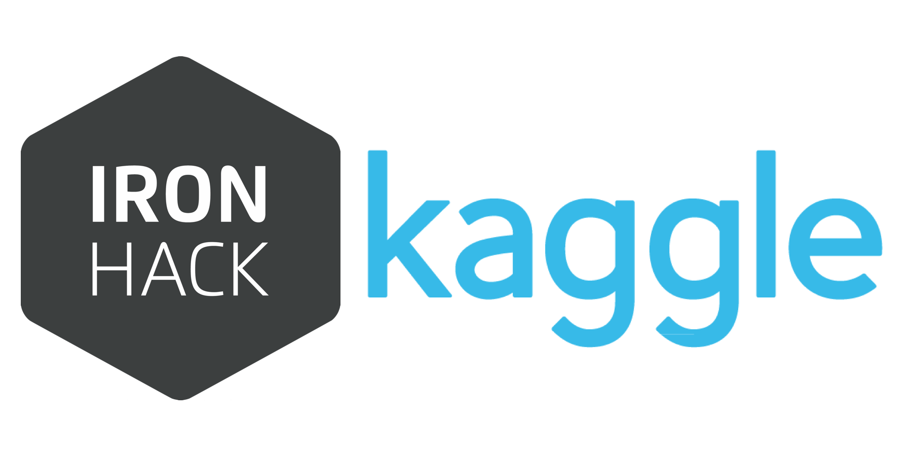

# ironKaggle

The objective of this project is to predict the revenue of a shops in each day for a data set. For that we created a cell which tries different machine learning methods in order to get the best prediction score possible.
To do it we follow the next steps:
1.	Import all the necessary libraries and the data (visualising it).
2.	Data wrangling (Cleaning the data, splitting the target and the features, and creating the test and train sets for the prediction models.
3.	Building a for loop to try different supervised machine learning methods (prediction models), in order to check which one gives the best score for our data set. As well as, an additional cell to calculate the best parameters for machine learning models such as "Decision tree regressor" or "Random forest regressor".
4.	Import and clean the new data set with the data to predict, and predict it.
5.	Exporting all the necessary files.
 
